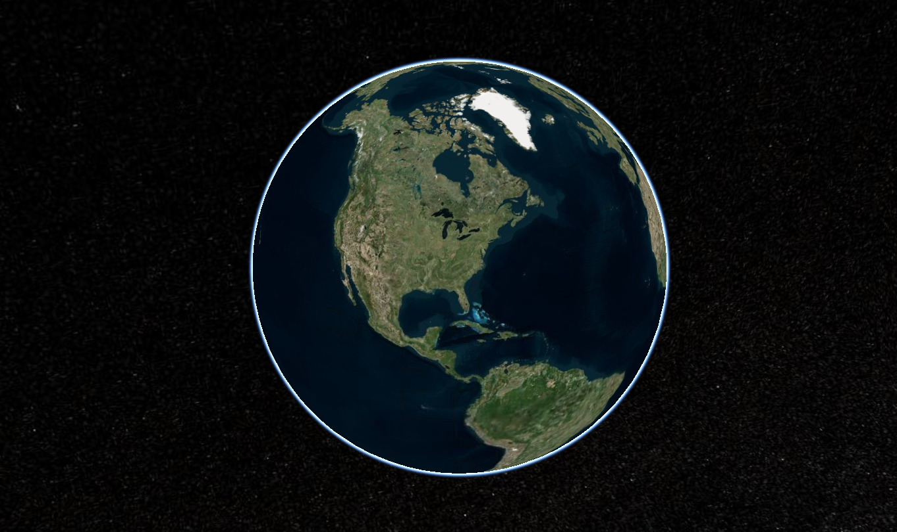

# 得实中间件后台管理页面

> Element UI admin-vue

## scripts

```bash
# install
npm install

# develop
# http://localhost:9002/#/login
npm run dev

# 预览发布环境效果
npm run preview

# 代码格式检查

npm run lint

# 代码格式检查和自动修复
npm run lint --fix

# svg压缩
npm run svg
```
## 添加更新内容

```bash
# vue 引入cesiumJS
 CesiumJs 是一款3维视图的一个数据框架,方便进行3d地图环保海洋等多功能的开发

 #效果展示如下图
 
```